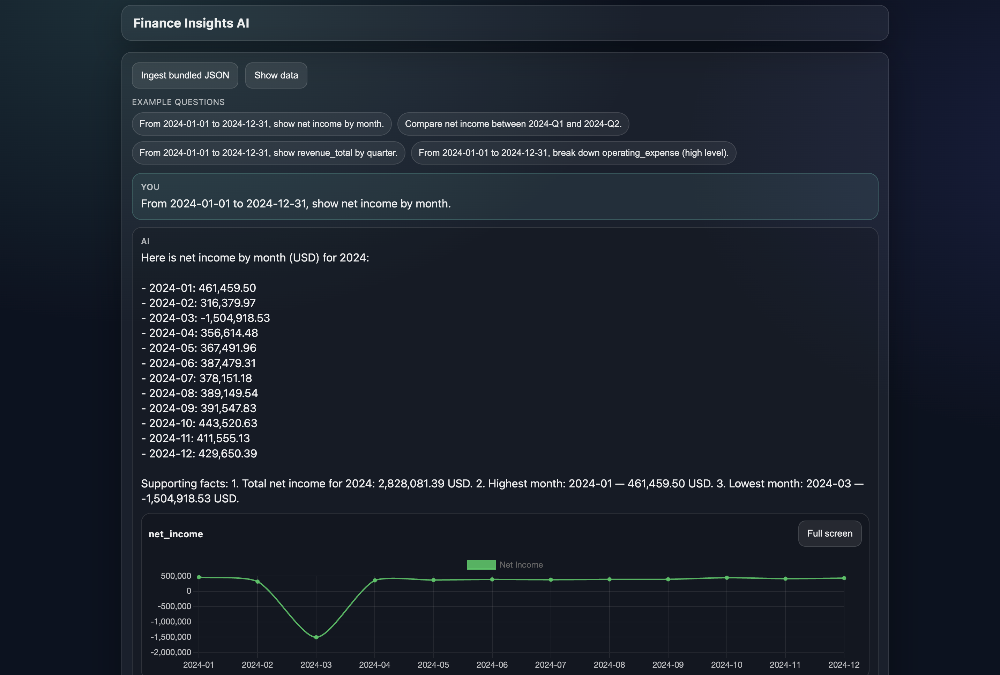

# Finance Insights AI

Small demo system that ingests two P&L JSON sources (`data1.json`, `data2.json`), normalizes them into a single monthly source of truth in SQLite, exposes REST APIs, and supports NLQ + narrative answers via the OpenAI API (tool-backed; no invented numbers).



## Quick start (backend)

```bash
cd backend
python -m venv .venv
source .venv/bin/activate
pip install -r requirements.txt

uvicorn app.main:app --reload --port 8000
```

## OpenAI API key (required for chat)

The NLQ chat endpoint (`POST /api/v1/chat`) requires an OpenAI API key.

Create `backend/.env` from the example and set `OPENAI_API_KEY`:

```bash
cp backend/.env.example backend/.env
```

Then edit `backend/.env` and set:
```bash
OPENAI_API_KEY=your_key_here
```

## Quick start (data)(optional if app.db already present)
Ingest bundled data if app.db is not generated yet:

```bash
curl -X POST http://localhost:8000/api/v1/ingest \
  -H 'Content-Type: application/json' \
  -d '{"mode":"replace"}'
```

## Quick start (frontend)

```bash
cd frontend
npm install
npm run dev
```

Optionally set the API base URL (defaults to `http://localhost:8000/api/v1`):

`frontend/.env`
```bash
VITE_API_BASE_URL=http://localhost:8000/api/v1
```

## Environment variables (backend)

- `DB_PATH` (default: `<repo>/app.db`)
- `DATA1_PATH` (default: `<repo>/data1.json`)
- `DATA2_PATH` (default: `<repo>/data2.json`)
- `PRIMARY_SOURCE` (`quickbooks` or `rootfi`, default: `rootfi`)
- `MERGE_TOLERANCE` (absolute if `>= 1`, percent if `< 1`, default: `1.0`)
- `OPENAI_API_KEY` (required for `/api/v1/chat`)
- `OPENAI_MODEL` (default: `gpt-5-mini-2025-08-07`)
- `CORS_ORIGINS` (comma-separated, default: `http://localhost:5173`)

## API endpoints

- `POST /api/v1/ingest`
- `GET /api/v1/periods`
- `GET /api/v1/metrics/timeseries`
- `GET /api/v1/metrics/compare`
- `GET /api/v1/breakdown`
- `POST /api/v1/chat` (requires `OPENAI_API_KEY`)

## Render blueprint (optional)

`render.yaml` is included as a starting point. Update `CORS_ORIGINS` and `VITE_API_BASE_URL` to match your deployed URLs.
